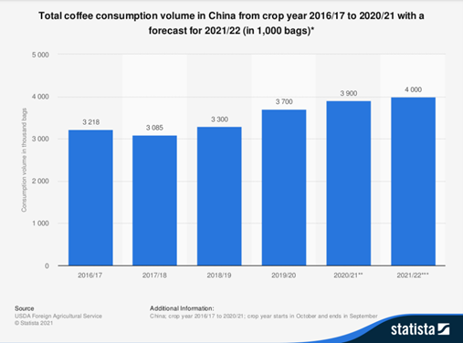
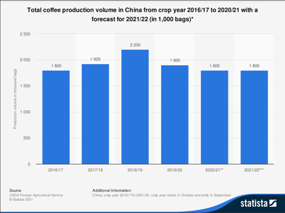

```{css echo=FALSE}
@import url('https://fonts.googleapis.com/css2?family=Fira+Code:wght@300;400;500;600;700&display=swap');
code{
  font-family: 'Fira Code'!important;
}
```

```{r setup, include=FALSE}
knitr::opts_chunk$set(echo = TRUE, comment="", warning = FALSE, message = FALSE, tidy.opts=list(width.cutoff=55), tidy = TRUE)
```

```{r init_env} 
if (!require(downloader)) install.packages("downloader")
downloader::source_url("https://raw.githubusercontent.com/DMinghao/Analysis_Pocketknife/main/R/import.R", downloader::sha_url("https://raw.githubusercontent.com/DMinghao/Analysis_Pocketknife/main/R/import.R"))

clear_all_()

import_init_()
import_helper_()
import_plotly_()

pkg_list <- c(
  "tidyverse", 
  "tidymodels", 
  "kernlab", 
  "pracma", 
  "stats", 
  "ggplot2", 
  "plotly", 
  "pwr", 
  "progress", 
  "doParallel", 
  "htmlwidgets", 
  "RefManageR")
load_pkgs(pkg_list)

set.seed(123)
cores <- detectCores() - 1
cluster <- makeCluster(
  cores,
  type = "PSOCK"
  )
registerDoParallel(cl = cluster)
```

## Part 1:  Research Proposal

### Executive Summary / Abstract

**Fengyuan Tian - 100%**: 

For centuries, coffee has been one of the most popular beverages around the world. It is also a valuable commodity that impacts many countries and businesses around the globe. 

In general, two main groups of coffee are fresh coffee and instant coffee. When we talk about instant coffee, we can always recall a company called Nestle. Nestle is the largest multinational food and drink manufacturer measured by revenue that they generated $76.8 billion in 2020. (Spector, 2021) Nestle's business spreads over more than 180 countries globally. The Greater China Region (Mainland China, Hong Kong, Macau, and Taiwan) is the market that generates the most profits besides Europe and North America. 

Due to the pandemic and intense competition, Nescafe is seeing a savage drop in sales in the Chinese market. Therefore, as a group of analysts, we are helping Nescafe investigate the necessity of launching a new product called concentrated coffee pods to recap its sales in the Greater China Region.

We are conducting experimental research to present the most accurate result. According to the hierarchical classification of cities in China, we applied a simple random sample to evenly split 108 cities into two groups: 54 cities in the control group and 54 cities in the treatment group. Therefore, the participants are the retail stores in each city. The dependent variable in our study is the total sales of Nescafé in a fiscal year from January 2023 to January 2024. The independent variable in our research is the launch of the concentrated coffee pods. We will launch the concentrated coffee pods in the treatment group at the beginning of the experiment. And we will collect the sales data at the end of the experiment period from all samples to compare and analyze the necessity of launching the new product. We choose to conduct a two-sample t-test in this case because we would like to compare the difference of mean between the control group and the treatment group. 


### Statement of the Problem

**Fengyuan Tian (100%)**: 

Nowadays, coffee has become an essential beverage for working people especially. As a result, the market size of coffee is vast. According to Verified Market Research, the market size of instant coffee reached $25.09 billion in 2020 in the world. (VMR, 2021)

With the development of the times and changes in people's needs, there are several types of instant coffee nowadays. In terms of Nestle and instant coffee, the "powdered and liquid beverages" sector is Nestle's most important and most profitable sector. Within the sector, Nescafe is the most famous and symbolic subsidiary corporation that is famous for making soluble coffee.

Numerous newly-rising companies challenge the sales of Nescafe in China. According to the Annual Report of Nestle in 2019, the sales in the Greater China Region declined 1.3%. (Nestle Annual Review, 2019) Things got worse due to the COVID-19 pandemic in 2020. According to the Annual Report of Nestle in 2020, the sales in the Chinese market declined 13.4%. (Nestle Annual Review, 2020) Manufacturers in China invented and produced various forms of instant coffee applicable to multiple scenarios, such as "freeze-dried coffee" and "coffee drip bag." The most recent trending instant coffee in the Chinese market is the concentrated coffee pod.

The concentrated coffee pods are a syrup-like product extracted from coffee beans and then vacuum-frozen at extremely cold temperatures. In contrast with other kinds of instant coffee, the pods are tiny and portable, so you only need a cup of water or milk, no matter if it is hot or cold, to dilute the concentrated pods.

Therefore, Nescafe is conducting experimental research to help them decide whether it should launch the concentrated coffee pods to recapture its sales and compete with these new emerging forces. 


### Research Questions and Hypotheses 

**Fengyuan Tian (100%)**: 

The research question of this study is: “Will the launch of Nescafe concentrated coffee pods increase Nescafe’s sales in the Chinese market?”

The null hypothesis is that the launch of Nescafe concentrated coffee pods will not change Nescafe’s sales in the Chinese market. And the alternative hypothesis is that the launch of Nescafe concentrated coffee pods will change Nescafe’s sales in the Chinese market.

Address it mathematically, 

$$
H_0 : \mu (Sales_{Pods}) - \mu (Sales_{No Pods}) = 0
$$
$$
H_A : \mu (Sales_{Pods}) - \mu (Sales_{No Pods}) \neq 0
$$


### Importance of the Study

**Fengyuan Tian (34%) Minghao Du (33%) Haohua Lu (33%)**: 

First of all, the concentrated coffee pods are a brand-new product that there is no sufficient data such as sales data to analyze. Therefore, it is necessary to conduct profound research since it has never been done before. 

Secondly, the cost of failure of the product can be numerous since manufacturers have to invest money to build a new product line and to launch advertisements. Larger manufacturers usually have a higher cost of investment since they would need to produce larger quantities than other manufacturers. Unlike other small manufacturers, Nestle can spend time and money in advance to conduct the research to lower the risk and avoid investment failure. 

Lastly, the return of the experiment is substantial. By conducting this research, we are able to collect a lot of the newest data in the Chinese market. Also, this experimental design can be treated as a basic template that Nestle can apply when they are considering launching new products in the future. 


### Literature Review

**Minghao Du (50%) Haohua Lu (50%)**: 

The purpose of this research is to find out whether promoting a new product would impact the overall sales of the company. In this specific case, we are looking for how the Chinese coffee market reacts to Nescafe’s new concentrated coffee pods. As indicated in Figure 1, the total coffee consumption in China reveals an upward trend. However, Figure 2 suggested that the coffee production in China is showing a decrease from 2018/19 to 2020/21 and the projected production for 2021/22 is expected to remain the same as 2020/21. Through the change in sales, we will be able to see the company’s performance relative to its competitors as well as its competitiveness in the market. (Baker, W. E., & Sinkula, J. M., 2005) 

#### Coffee market in China

Different from other markets, the Chinese consumer market relies on basic cultural competence. Consumers in China have a tendency to be more attached to their previous experiences and traditions. They tend to stick to one or two brands that they trust, this is based on their past experience and they are unlikely to switch brands. (Zhang N, 2014)  Based on this characteristic of the Chinese consumer market, it is more likely for the new product from Nestle Cafe to be accepted by the Chinese consumers when compared to the other coffee brands considering that Nestle Cafe entered the Chinese market relatively early and has built up their reputation among the coffee consumers in China.


#### Impact of the new product

As stated in the previous section, Nescafe is considering launching a new concentrated coffee pod product in the Chinese market. There exists past research that studied the relationship between launching new products and sales growth. Referring Li & Lin, 2015, it explored the relationship between sales performance and several impacting factors that are associated with imported new products. In this study, the research results demonstrated that product meaningfulness (p < .01), product superiority (p < .001), and customer familiarity (p < .001) are having positive and significant effects on new product’s sales performance. 

#### A previous study of the consumers’ willingness to pay for coffee in China

We would also like to know how coffee consumers of China will react when there is a new product being introduced to the market. Yang et al.(2012) researched to find out whether the amount of information regarding the product would be considered as a factor when the customers are making their decision. The study implemented maximum likelihood estimation while using linear ordinary least square (OLS) regression to provide a baseline estimate for the parameters involved. Four of the coefficients (age, marry, flavor and org_known) stood out as they were measured with consistent signs and significance with “marry” and “flavor” being mostly marginal significant. Therefore, the research reflects that not all consumers are willing to pay the same amount for a fair trade coffee. Upon further classification based on the consumers’ demographic features and age, we would expect a difference in customer willingness to purchase.


### Research Plan

**Jiaman Li (50%) Xiangping Zhou (50%)**:

#### Population of Interest

Since the market scope of launching liquid concentrated coffee pods is in first-tier, New first-tier, second-tier, and third-tier cities. In China, cities are ranked based on their economic level of cities and reflect differences in local income level, population, infrastructure, talent pool, business opportunities, etc. Our group selects the general public at these Tier cities as our population of interest. To be specific, the general public includes:
-   Existing consumers of Nestlé brand and coffee products
-   Consumers who buy coffee products but not the Nestlé brand


#### Sample Selection

The margin of error = 5%
Confidence level = 95%

Population Size: 119 cities

| Classification 	|  n  	|
|:--------------:	|:---:	|
| First-tier     	|  4  	|
| New first-tier 	|  15 	|
| Secend-tier    	|  30 	|
| Third-tier    	|  70 	|
|      Total     	| 119 	|

 
Sample = 54 cities

| Classification 	| Treatment 	| Control 	|
|:--------------:	|:---------:	|:-------:	|
| First-tier     	|     1     	|    1    	|
| New first-tier 	|     7     	|    7    	|
| Secend-tier    	|     13    	|    13   	|
| Third-tier    	|     33    	|    33   	|
|      Total     	|     54    	|    54   	|

#### Sample Size

Our team decided to select our samples from the representative cities in first-tier, new first-tier, second-tier, and third-tier city-list based on the hierarchical classification of cities in China. According to the data of the China Business Network, China has 4 first-tier cities, 15 New first-tier cities, 30 second-tier cities, and 70 third-tier cities in 2021, with a total of 119. By setting the confidence interval at 95%, margin error at 10%, and response distribution at 50%, we come up with a sample size with a total of 54, which include 1 city from the first-tier city, 7 cities from the new first-tier city, 13 cities from the second-tier city, and 33 cities from the third-tier city. In the details, the number of sample cities in each tier is calculated by the ratio of the total number of cities in each tier. Also, the selected cities in each tier should be representative of other cities in the same tier based on some indicators such as economic level, demographic characteristics, and the level of sophistication in products and services.


#### Operational Procedures

- **Step 1:** Based on the hierarchical classification of cities in China, our team used simple random sampling to select cities from each tier of cities in China and formed our treatment and control groups. In detail, each group has 54 cities in total: 1 first-tier city, 7 new first-tier cities, 13 second-tier cities, and 33 third-tier cities. In the treatment city group, we will release the Nescafé Concentrated Coffee Pods for sale, and for cities in the control group, we will not launch the new product. Besides, we will keep the operation of the previous existing products in these cities.

- **Step 2:** Launch Nescafé Concentrated Coffee Pods to 54 selected cities in the treatment group and put new products on the shelves of brick-and-mortar stores, including small chain convenience stores such as 7-Eleven and median and large grocery stores such as Walmart, on December 1st, 2021. Additionally, the small private stores will not carry the product and be excluded from the treatment since those stores have limited sales information that lacks standardization and has low accuracy. As a result, the data collection procedure will be complicated, and the accuracy of our study will be affected.

- **Step 3:** Collect sales data from our control group and treatment group in one year based on the sale cycle of the Nescafé Concentrated Coffee Pods.

- **Step 4:** Tidy sales data and turn it into business metrics that could prove the market effectiveness of the Nescafé Concentrated Coffee Pods.

- **Step 5:** Compare the overall changes in sales of Nestle’s coffee business in the test and control groups.

- **Step 6:** Conclude the test and come up with a recommendation of Nescafé Concentrated Coffee Pods’ launch plan.


### Brief Schedule

| Behavior 	| Time  	| Participants 	|
|:---:	|:---:	|:---:	|
| Perform the experiment: Launch new products in the treatment city group 	| January 1st, 2022 	| The chain stores selected for 108 cities<br>(54 cities each in the treatment and control groups) 	|
| End of the experiment 	| December 31st, 2022 	|  	|
| Collect sales data 	| January 1st, 2023 to January 31st, 2023 	|  	|
| Statistical Analysis of the acquired data 	| February 1st, 2023 to February 15th, 2023 	|  	|


#### Data Collection

Our data collection will be based on shops' sales in our control group and treatment group. Stores under the retail channel will have sales records of Nestlé coffee. We collect the store sales data of our new products in the sample cities every month from our treatment and control groups, 54 cities in each group. For further testing, we will use city-level data containing 108 observational rows. We would then compare the mean sales volume of the control and treatment cities after conducting the test. In addition, some confounding variables, such as promotional activities and coffee consumption trends, may coexist and impact our study, underestimating the impact of the newly launched Nescafé Concentrated Coffee Pods on market sales. We would randomly select cities for the control and treatment groups to minimize the effect of confounding variables.


#### Data Security

Since we only collect the sales volume and amount data, there is no sensitive data related to customers’ personal information, so there will be no privacy problems.


#### Outcomes (Dependent Variables)

Dependent Variable (Y): Total sales of Nescafé (Nestlé SA) in a fiscal period.


#### Treatments (Independent Variables)

Independent Variable (X): The launch of Nestlé concentrated coffee pods (Yes=1, No=0)
Considering our independent variable is a dummy variable, we use a Two-sample t-test to measure the effectiveness of the launch of Nestlé concentrated coffee pods on the total sales of Nescafé, and assume the model as:

$$
Y_i = b_1X_i+b_2+u_i
$$

Where Y is the total sales of Nescafé (Nestlé SA) in a fiscal period, and

$$ 
X =
\begin{cases}
1 = Yes\\
0 = No
\end{cases}
$$ 

If we launch the new product, which means X = 1, bring it into the model and we get:
$Y_i=b_1+b_2+u_i$, the expected value is ${E(Y}_i)=b_1+b_2$

In contrast, if we don’t launch the new product, which means X = 0, bring it into the model and we get:
$Y_i=b_2+u_i$, the expected value is ${E(Y}_i)=b_2$

Our null hypothesis assumes that the total sales of Nescafé with the launch of the concentrated coffee pods will be significantly different from that without the launch, and the average difference is the coefficient of X.

The category with zero value is called the base, the benchmark for comparison with other categories. The common intercept item is the intercepted item of the base class.

$b_1$ is called differential intercept coefficient, which indicates the difference between the intercept value of the category with a value of 1 and the intercept value of the base class.

We will use a two-sample test to test whether the difference between the classification with X equal to 1 and the base class is significant.


#### Other Variables

**Fengyuan Tian (100%)**: 

| Variables 	| Possible Values 	| Descriptions 	|
|:---:	|:---:	|:---:	|
| Retail Price 	| $3 per bag 	| In this research, we must make sure that the same retail price for this product is in each store. 	|
| Packaging 	| The appearance of the product 	| The design and the packaging appearance are the same. 	|
| Marketing strategy 	| Number of advertisement 	| In this experiment, we did not propose any advertisement for the concentrated coffee pods, we needed to make sure that each store would not make any advertisement for this product. 	|
| Capacity 	| 25 ml 	| We need to make sure that the capacity is constant for all pods. 	|


### Statistical Analysis Plan  

**Haohua Lu (50%) Minghao Du (50%)**: 

Due to the nature of which data in this study will be simulated, the team will predetermine some attribute values for sales data generation. In the analysis stage, we will perform exploratory and quantitative analysis on the simulated data. Both of which will help the team better assess the result of the experiment. They also help the team better understand the overall geometrics of response values across different parameter value combinations. 

#### Data simulation

To generate the most realistic sales data, we decided to use the existing data regarding the count of coffee companies in different city tiers to help decide the mean of sale; as this reflects customers in given cities’ coffee demandingness, to some degree of extent. Such that, the standard deviation of sales can also be calculated from the same data set. Before generating sales data, mean and standard deviation differences between city tiers are normalized. For the baseline sales mean, the team arbitrarily chose 100, and 10 for standard deviation. In order to obtain the most representative data, we decided to run the simulation 1000 times to capture the designated sales data distribution.  
	
#### Exploratory analysis 

By performing exploratory analysis, we first take a glance at our data to spot the patterns if there are any. Other than that, several plots will be generated to make sure data simulated are as expected. Following that, we will also calculate statistic properties of the simulated data to make sense of the overall data geographic. 

#### Quantitative analysis 

Two sample t-tests will be performed based on the null hypothesis being that promoting a new type of coffee has no effect on Nestle’s coffee sale and the alternative hypothesis being that the new type of coffee does have some effect. We choose to perform a two-sample t-test since the predicting sales are continuous and we are aiming to compare the difference in the mean between the treatment group and the controlled group. In terms of our sample population,  the controlled group and treatment groups in our study are grouped based on the level of cities. We consider focusing on the power, p-value, and effect size resulting from our test. Scenarios like significant p-value with low power and insignificant p-value with high power are not acceptable from the outcome.


### Limitations and Uncertainties

**Minghao Du (20%) Haohua Lu (20%) Fengyuan Tian (20%) Jiaman Li (20%) Xiangping Zhou (20%)**: 

#### Sample Selection Bias

In terms of sample selection, we choose first-tier, new, first-tier, second-tier, and third-tier cities in China as our target cities, and then use stratified sampling to set our treatment and control group. But consumers in offline stores are entirely random, and there is no guarantee that they cover all of our four customer groups. Therefore, we assume the experiment process as a black box and take the randomness as part of the market.

#### Lack of Online Channels

Online sales account for a relatively large part of Nescafé. Still, since it is hard to set the control group online and it will be a separate experiment to test online channels, we only consider offline channels in this experiment. We will use historical sales data based on the proportion of online and offline channels to predict and supplement online sales.

#### Long Experiment Period

Considering the sales cycle and seasonal effect of coffee products, we set the experiment period as one year. The long period may allow the competitor to launch new products first and take the lead in the market. But we will collect and test the data each month to monitor the real-time change of sales and draw conclusions in an effective shorter period.

#### Accuracy of Data Collection

Sales data of offline stores usually are collected by records of the cash register and manual aggregation. There may be a human error during the process. Therefore, we can increase the frequency and reduce the time gap of collecting data to lower the risk of error and ensure data accuracy through data proofreading in different periods.

#### Location on the shelf

Each retail store and supermarket have their own way of arranging goods. The location of the concentrated coffee pods on the shelves is important, and it would impact the sales of this product. It is impossible to require each store and supermarket to place the pods in the same location. Therefore, the location on the shelves would cause bias.

#### Pandemic

The COVID-19 pandemic had a significant influence on our society. In China, they have a strict strategy dealing with the pandemic breakout. For example, whenever a city has increasing cases, the Chinese government may shut down the entire city and require every citizen to stay at home. Meanwhile, facilities such as supermarkets may close as well. Therefore, it can have a massive influence on sales.

#### Competitors

Many competitors make similar products of instant coffee in China. Therefore, actions from competitors such as launching new products, promotion, advertising would impact the sales of our product. Since it is impossible to control competitors, it could cause a bias.


## Part 2:  Simulated Studies

**Minghao Du (20%) Haohua Lu (20%) Fengyuan Tian (20%) Jiaman Li (20%) Xiangping Zhou (20%)**: 

### Init perameters 

The first step was to create an empty dataset. Based on our sample selection, we simulated the sales data in 108 cities, including 2 first-tier cities, 14 new first-tier cities, 26 second-tier cities, and 66 third-tier cities. The cities were evenly split into control and treatment groups. Then, we set mean and standard deviation scales for city tiers based on the number of coffee enterprises in each city. According to a report from Pintu, we calculated the average and standard deviation of coffee shop numbers in each city and then used those numbers to decide the size of the various tiers.


```{r}

n <- 108

cityClass <- c(
  rep("First", 2),
  rep("New-First", 14), 
  rep("Secend", 26), 
  rep("Third", 66))

cityClassNum <- c(
  rep(0, 2),
  rep(1, 14), 
  rep(2, 26), 
  rep(3, 66))

group <- rep(c("Treatment","Control"), n/2)

emptyData <- data.frame(Group = group, City_Tier = cityClass, City_Tier_Num = cityClassNum)

t1CoffeeShops <- c(1297, 2278, 1725, 2377)
nt1CoffeeShops <- c(1867, 1253, 1327, 983, 834, 1086, 1054, 1381)
t2CoffeeShops <- c(1099, 244, 497, 556, 339, 228, 483, 325)
t3CoffeeShops <- c(146, 258, 184, 216, 127, 59, 149, 86)

t1M <- mean(t1CoffeeShops)
t1SD <- sd(t1CoffeeShops)
nt1M <- mean(nt1CoffeeShops)
nt1SD <- sd(nt1CoffeeShops)
t2M <- mean(t2CoffeeShops)
t2SD <- sd(t2CoffeeShops)
t3M <- mean(t3CoffeeShops)
t3SD <- sd(t3CoffeeShops)

# Sales mean scale for city tiers 
sales_M_factor <- c(t1M, nt1M, t2M, t3M) / t1M

# Sales SD scale for city tiers 
sales_SD_factor <- c(t1SD, nt1SD, t2SD, t3SD) / t1SD

```

### Helper Functions 

The second step was to create four simulation and evaluation functions. The first one is a function that computes a sales value based on a data frame’s mean and standard deviation. Sales are calculated using df, mean, standard deviation, sales_M_factor, and sales_SD_factor.

The second function creates plots for the data frame. This allows us to observe the trend and differences in sales between each city.

A third function calculates the average sales results from the test. For each city, we group them into "Control" or "Treatment" cities. Using the t-test result, we will set the upper and lower bounds based on the coefficient. For comparison, we list the effect, lower bound, upper bound, and p-value in the result.

The fourth function utilizes the generateSales function to generate sales data for treatment and control groups. We set the baseline as follows: mean of treatment group = 100, the standard deviation of treatment group = 10, mean of the control group is 90, the standard deviation of the control group is 5.


```{r}

# function to generate sales value from mean and SD for a dataframe
generateSales <-
  function(df, 
           mean,
           sd,
           SMF = sales_M_factor,
           SSDF = sales_SD_factor) {
    out <- df %>%
      rowwise() %>%
      mutate(Sales = rnorm(1, mean = mean * SMF[City_Tier_Num + 1], sd = sd * SSDF[City_Tier_Num + 1]))
    return(out) 
  }

# function to make plots for dataframe 
plotSales <- function(df) {
  p1 <- df %>% ggplot() + 
    geom_density(aes(Sales, color = Group)) 
  p1 <- p1 %>% ggplotly()
  p2 <- df %>% ggplot() + 
    geom_density(aes(Sales, color = City_Tier)) + 
    facet_wrap(~Group)
  p2 <- p2 %>% ggplotly()
  p3 <- df %>% 
    group_by(Group, City_Tier) %>% 
    summarize(AvgSales = mean(Sales)) %>% 
    ungroup() %>% 
    ggplot() + 
    geom_col(aes(AvgSales, City_Tier, fill = Group), position = "dodge")
  p3 <- p3 %>% ggplotly()
  
  list(p1, p2, p3)
}


# function to calculate Sales mean ttest results from a dataframe 
analyzeData <- function(df) {
  tTest <-
    t.test(
      df %>% filter(Group == "Treatment") %>% select(Sales),
      df %>% filter(Group == "Control") %>% select(Sales)
    )
  the.effect <- tTest$estimate[[1]] - tTest$estimate[[2]]
  lower.bound <- tTest$conf.int[1]
  upper.bound <- tTest$conf.int[2]
  p <- tTest$p.value
  result <- list(effect = the.effect, lower_ci = lower.bound, upper_ci = upper.bound, p = p)
  
  return(result)
}

# function to use `generateSales` make sales data for treatment and control group 
simSalesDF <-
  function(DF = emptyData,
           treatM = 100,
           treatSD = 10,
           ctrlM = 90,
           ctrlSD = 5,
           SMF = sales_M_factor,
           SSDF = sales_SD_factor) {
    treatmentData <-
      DF %>% filter(Group == "Treatment") %>% generateSales(treatM, treatSD, SMF, SSDF)
    controlData <-
      DF %>% filter(Group == "Control") %>% generateSales(ctrlM, ctrlSD, SMF, SSDF)
    
    sim.data <- treatmentData %>% rbind(controlData) %>% ungroup()
    
    return(sim.data)
  }
```

### Explore simulated data 

#### Single Simulation

We finalized the simulated data and plotted the data to make sure all functions worked.


```{r paged.print=TRUE}
# make sure all function works 

sim.data <- simSalesDF(emptyData, 110, 10, 100, 10, sales_M_factor, sales_SD_factor)

sim.data

plots <- plotSales(sim.data)

plots[[1]]
plots[[2]]
plots[[3]]

analyzeData(sim.data)
```

Finally, we constructed a power t-test to test the ideal effect size. Assume the power of the test is 0.9, according to the test result, the effect size should be 62. But due to the limitation of the size of cities, we are not able to reach the ideal sample size. But the result can provide us a reference for further analysis.


```{r}
pwrTest <- pwr.t.test(n = n/2, power = 0.9)
pwrTest
```

#### Single Experiment 

For experiment, we first set the number of simulation = 1000, mean of the control group = 100, standard deviation of the control group = 10, effect size = 55, significance level = 0.05. Then we run the simulation based on these parameters. Using the t-test, we got the result of the simulation: The Power of the test with an effective size of 55  and a significant level of  0.05 is 0.796.


```{r}
# Number of simulations 
B <- 1000 

Experiment <- 1:B 

DFList <- c()

ctrlMean <- 100
stdDiv <- 10
effectSize <- 55
sigLevel <- 0.05

# run simulations
pb <- progress_bar$new(total = B)
for (i in Experiment) {
  pb$tick()
  DFList[[i]] <-
    emptyData %>% simSalesDF(ctrlMean + effectSize,
                             stdDiv,
                             ctrlMean,
                             stdDiv,
                             sales_M_factor,
                             sales_SD_factor)
}

expSimData <- tibble(Experiment = Experiment, DF = DFList)

# get t-test result for simulation 
simDataAnalyzed <- expSimData %>% mutate(Result = map(DF, analyzeData)) %>% unnest_wider(Result)

print(paste("Power with an effective size of ", effectSize, " and a significant level of ", sigLevel," : ", mean(simDataAnalyzed$p < sigLevel)))
print(paste("Average P-value",mean(simDataAnalyzed$p)))
summary(simDataAnalyzed$effect)
summary(simDataAnalyzed$lower_ci)
summary(simDataAnalyzed$upper_ci)

```

#### Experiments for different effective size

Next, we defined the effective size range to be tested as [30, 70]. For each effective size, we run an experiment of 1000 simulations to determine the power. We also got the effective size threshold given a significant level.


```{r paged.print=TRUE}
# define effective size range to be tested
eSize <- seq(30, 70)

# for each effective size run one experiment of 1000 simulations to determine the power
result <-
  foreach(x = eSize,
          .combine = rbind,
          .packages = c("tidyverse")) %dopar% {
            B <- 1000

            Experiment <- 1:B

            DFList <- c()

            ctrlMean <- 100
            stdDiv <- 10
            effectSize <- x
            sigLevel <- 0.05

            for (i in Experiment) {
              DFList[[i]] <-
                emptyData %>% simSalesDF(ctrlMean + effectSize,
                                         stdDiv,
                                         ctrlMean,
                                         stdDiv,
                                         sales_M_factor,
                                         sales_SD_factor)
            }

            expSimData <- tibble(Experiment = Experiment, DF = DFList)

            simDataAnalyzed <-
              expSimData %>% mutate(Result = map(DF, analyzeData)) %>% unnest_wider(Result)
            eP <- mean(simDataAnalyzed$p < sigLevel)
            eAp <- mean(simDataAnalyzed$p)
            eF <- mean(simDataAnalyzed$effect)
            eU <- mean(simDataAnalyzed$upper_ci)
            eL <- mean(simDataAnalyzed$lower_ci)

            c(x, eAp, eP, eF, eL, eU)
          }

effectPower <- as.data.frame(result) %>% as_tibble()

colnames(effectPower) <- c("eSize", "eAvgP", "ePow", "eEfs", "eLow", "eUp")

# given a significant level see the effective size threshold
effectPower <- effectPower %>% mutate(passed = ifelse(ePow < (1-sigLevel), F, T))

effectPower
```

To evaluate the power of the test, we built a plot to show the experiment power based on different effect sizes. We set a baseline of power as 0.95. The plot shows that when the effect size is over 60, the power test would surpass the baseline, which means that at this level, the probability of our result is larger than 95%.

```{r}
# plot effective size vs experiment power
fig <- effectPower %>% ggplot() +
  geom_point(aes(eSize, ePow)) +
  geom_hline(aes(yintercept = 1 - sigLevel))

fig %>% ggplotly()
```

Further, we plotted the trend of p-value with the change of effect size. As shown in the graph, when the effect size is larger than 60, the average p-value reduces to less than 0.05. A p-value less than 0.05 is statistically significant. It indicates strong evidence against the null hypothesis, as there is less than a 5% probability the null is correct.

```{r}
# plot Avg P vs experiment power
fig <- effectPower %>% ggplot() +
  geom_point(aes(eSize, eAvgP)) +
  geom_hline(aes(yintercept = sigLevel))

fig %>% ggplotly()
```

#### Fancy Plots 

```{r}

#Graph Resolution (more important for more complex shapes)
graph_reso <- 0.01

#Setup Axis
axis_x <- seq(min(effectPower$eAvgP), max(effectPower$eAvgP), by = graph_reso)
axis_y <- seq(min(effectPower$ePow), max(effectPower$ePow), by = graph_reso)

set.seed(123)
regModel <- svm_rbf(cost = 0.5, rbf_sigma = 0.8, margin = 0.01) %>%
  set_engine("kernlab") %>%
  set_mode("regression") %>%
  fit(eSize ~ eAvgP + ePow, data = effectPower)

#Sample points
xy <- meshgrid(x = axis_x, y = axis_y)
xx <- xy$X
yy <- xy$Y
dim_val <- dim(xx)
xx1 <- matrix(xx, length(xx), 1)
yy1 <- matrix(yy, length(yy), 1)
final <- cbind(xx1, yy1)
pred <- regModel %>% predict(final)

pred <- pred$.pred
pred <- matrix(pred, dim_val[1], dim_val[2])

# 3D plot for Average P vs effective size CI vs Power
effectPower %>%
  plot_ly(
    x = ~ eAvgP,
    y = ~ ePow,
    z = ~ eSize
  ) %>%
  add_markers() %>%
  add_surface(x = axis_x,
              y = axis_y,
              z = pred,
              type = 'mesh3d') %>%
  make_it_spin()

```

```{r}

#Graph Resolution (more important for more complex shapes)
graph_reso <- 0.01

#Setup Axis
axis_x <- seq(min(effectPower$eUp), max(effectPower$eUp), by = graph_reso)
axis_y <- seq(min(effectPower$eLow), max(effectPower$eLow), by = graph_reso)

set.seed(123)
regModel <- svm_rbf(cost = 0.25, rbf_sigma = 0.2) %>%
  set_engine("kernlab") %>%
  set_mode("regression") %>%
  fit(ePow ~ eUp + eLow, data = effectPower)

#Sample points
xy <- meshgrid(x = axis_x, y = axis_y)
xx <- xy$X
yy <- xy$Y
dim_val <- dim(xx)
xx1 <- matrix(xx, length(xx), 1)
yy1 <- matrix(yy, length(yy), 1)
final <- cbind(xx1, yy1)
pred <- regModel %>% predict(final)

pred <- pred$.pred
pred <- matrix(pred, dim_val[1], dim_val[2])

# 3D plot for lower CI vs upper CI vs Power
effectPower %>%
  plot_ly(
    x = ~ eUp,
    y = ~ eLow,
    z = ~ ePow,
    text = ~ paste('Effect Size: ', eSize)
  ) %>%
  add_markers() %>%
  add_surface(x = axis_x,
              y = axis_y,
              z = pred,
              type = 'mesh3d') %>%
  make_it_spin()

```


### Research Question 1:

#### Scenario 1:  No Effect

**Minghao Du (20%) Haohua Lu (20%) Fengyuan Tian (20%) Jiaman Li (20%) Xiangping Zhou (20%)**: 

Will the launch of Nescafe concentrated coffee pods increase Nescafe’s sales in the Chinese market?


##### Simulation

```{r q1_scenario1_simulation}
# Number of simulations
B <- 1000

Experiment <- 1:B

DFList <- c()

ctrlMean <- 100
stdDiv <- 10
effectSize <- 40
sigLevel <- 0.05

# run simulations
pb <- progress_bar$new(total = B)
for (i in Experiment) {
  pb$tick()
  DFList[[i]] <-
    emptyData %>% simSalesDF(ctrlMean + effectSize,
                             stdDiv,
                             ctrlMean,
                             stdDiv,
                             sales_M_factor,
                             sales_SD_factor)
}

expSimData <- tibble(Experiment = Experiment, DF = DFList)

```


##### Analysis

```{r q1_scenario1_analysis}

# get t-test result for simulation
simDataAnalyzed <- expSimData %>% mutate(Result = map(DF, analyzeData)) %>% unnest_wider(Result)

print(paste("Power with an effective size of ", effectSize, " and a significant level of ", sigLevel," : ", mean(simDataAnalyzed$p < sigLevel)))
print(paste("Average P value: ", mean(simDataAnalyzed$p)))
summary(simDataAnalyzed$effect)
summary(simDataAnalyzed$lower_ci)
summary(simDataAnalyzed$upper_ci)
```

The simulation result shows a P-value (0.1086) that is larger than 5%, which is not statistically significant. Therefore, we will accept our null hypothesis that the launch of Nescafe concentrated coffee pods will not increase Nescafe’s sales in the Chinese market. We reject our alternative hypothesis that the launch of Nescafe concentrated coffee pods will increase Nescafe’s sales in the Chinese market. In this scenario, we recommend not launching the Nescafe concentrated coffee pods in the Chinese market since it will not increase Nescafe’s sales.


#### Scenario 2:  An Expected Effect

**Minghao Du (20%) Haohua Lu (20%) Fengyuan Tian (20%) Jiaman Li (20%) Xiangping Zhou (20%)**: 


##### Simulation

```{r q1_scenario2_simulation}
# Number of simulations
B <- 1000

Experiment <- 1:B

DFList <- c()

ctrlMean <- 100
stdDiv <- 10
effectSize <- 60
sigLevel <- 0.05

# run simulations
pb <- progress_bar$new(total = B)
for (i in Experiment) {
  pb$tick()
  DFList[[i]] <-
    emptyData %>% simSalesDF(ctrlMean + effectSize,
                             stdDiv,
                             ctrlMean,
                             stdDiv,
                             sales_M_factor,
                             sales_SD_factor)
}

expSimData <- tibble(Experiment = Experiment, DF = DFList)
```

##### Analysis

```{r q1_scenario2_analysis}

# get t-test result for simulation
simDataAnalyzed <- expSimData %>% mutate(Result = map(DF, analyzeData)) %>% unnest_wider(Result)

print(paste("Power with an effective size of ", effectSize, " and a significant level of ", sigLevel," : ", mean(simDataAnalyzed$p < sigLevel)))
print(paste("Average P value: ", mean(simDataAnalyzed$p)))
summary(simDataAnalyzed$effect)
summary(simDataAnalyzed$lower_ci)
summary(simDataAnalyzed$upper_ci)
```

The simulation result shows a P-value (0.0292) that is less than 5%, which is statistically significant. Therefore, we will reject our null hypothesis that the launch of Nescafe concentrated coffee pods will not increase Nescafe’s sales in the Chinese market. We accept our alternative hypothesis that the launch of Nescafe concentrated coffee pods will increase Nescafe’s sales in the Chinese market. In this scenario, we will recommend launching the Nescafe concentrated coffee pods in the Chinese market since it will increase Nescafe’s sales.

## Appendix 



**Figure 1:** Total coffee consumption volume in China. (USDA Foreign Agricultural Service, June 21, 2020)



**Figure 2:** Total coffee production volume in China. (USDA Foreign Agricultural Service, June 21, 2020) 

## References

**Minghao Du (50%) Haohua Lu (50%)**: 

```{r}
ReadBib("my-paper.bib", check = FALSE) 
```


```{r}
stopImplicitCluster()
```
